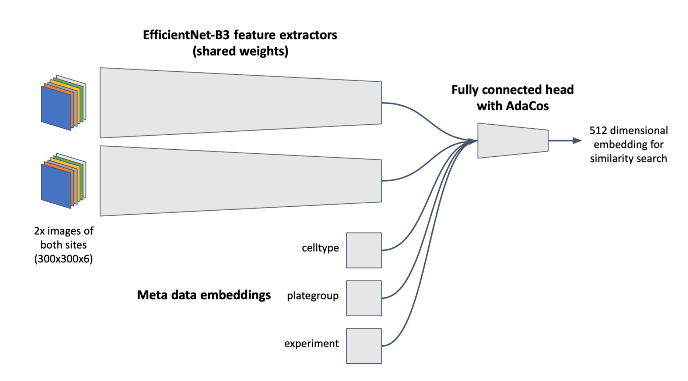
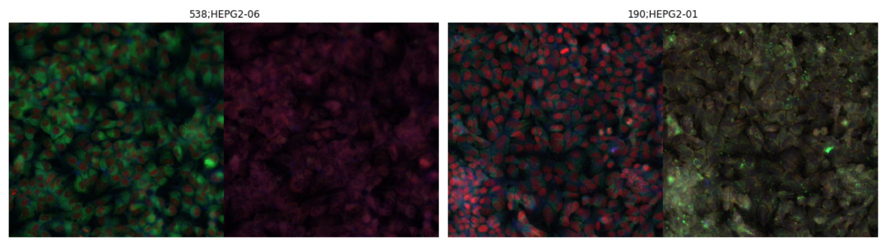

# 117th place solution [0.718] using PyTorch & fastai

*A big thank you goes out to the competition organizers and they great community!*

*This was my first kaggle competition I joined from the beginning and I learned a lot! :-D*

**Final setup for highest score:**

- [ImageNet-pretained EfficientNet-B3](https://github.com/lukemelas/EfficientNet-PyTorch) with 6D input stage (2x 3D weights copied to get 6D input stage at the beginning of training).
- [AdaCos metric learning approach](https://arxiv.org/abs/1905.00292) was implemented, which should be more stable without hyperparameter tuning when compared to other cosine-based softmax losses.
- Standard data augmentation (flip vertical/horizontal, rotation, zoom, lighting, warp) with custom implementation of [„Color Augmentation for histopathology images”](https://arxiv.org/abs/1707.06183). Data visualization function displaying the 6D images as 3D+3D image:

- Embedding layers for meta data to let the model learn from celltype, plategroup, and experiment data (i.e., data leak). (However, there was no time in the end to optimize the embeddings used for the full training and test predictions. Something like a similarity search for the test experiments would have been an interesting approach.)
- [CutMix]( https://github.com/oguiza/fastai_extensions/tree/master/shared/0_image_data_augmentation) was used for the image data for some parts of the training. In addition, a linear interpolation of the embeddings was used during CutMix training.
- Predictions were carried out with 3x TTA to obtain the feature embeddings of the image and meta data input.
- Finally, [FAISS]( https://github.com/facebookresearch/faiss) was used for cosine similarity search of the extracted feature embeddings.

**General training setup:**
1. Train new network output stage/head with frozen pretrained feature extractor network.
1. Retrain pretrained extractor network with new head (approx. 60 epochs).
1. Add meta data embeddings, freeze feature extractor network and train embeddings and output stage (approx. 50 epochs).
1. Train entire network (approx. 150 epochs).

For all training stages the [1cycle policy](https://sgugger.github.io/the-1cycle-policy.html) was used for several cycles. EfficientNet training was carried out with AdamW. CutMix was used for the late training stages.

**Notebooks:**
- EfficientNet-B3 training:
  - [Pretraining](https://github.com/MicPie/recursion-cellular-image-classification/blob/master/rcic_v20_efficientnet-b3.ipynb)
  - [Complex network](https://github.com/MicPie/recursion-cellular-image-classification/blob/master/rcic_v32_efficientnet-b3_celltype_plate-group-exp_Full.ipynb)
  - [Complex network 12D](https://github.com/MicPie/recursion-cellular-image-classification/blob/master/rcic_v41_efficientnet-b3_celltype_plate-group-exp_12D.ipynb) (2x 6 channel images)
- EfficientNet-B4 (not finished):
  - [Pretraining](https://github.com/MicPie/recursion-cellular-image-classification/blob/master/rcic_v43_efficientnet-b4_Mish_Ranger_LabelSmoothingLoss.ipynb)
  - [Complex network 12D](https://github.com/MicPie/recursion-cellular-image-classification/blob/master/rcic_v44_efficientnet-b4_celltype_plate-group-exp_12D_model-exchange.ipynb)

**What didn’t work out or had no impact over a more basic setup:**
- Separate classifiers for celltypes and/or plategroups (i.e., siRNA groups of 277).
- Some domain adaption techniques.
- Mean or k-means clustering of siRNA feature embeddings for cosine similarity search.

**Learnings:**
- A lot about PyTorch, fastai, and adjacent DL/ML topics.
- Stay longer on the smaller model side, do more A/B or CV testing of improvements, then first really over-fit, and then try to reduce it.
- EfficientNet-B3 retraining took forever and training of EfficientNet-B4 was not finished at the competition deadline (however, this looked very promising).

If you have any questions or are interested in further information, please feel free to contact me! :-)

Thank you very much!
